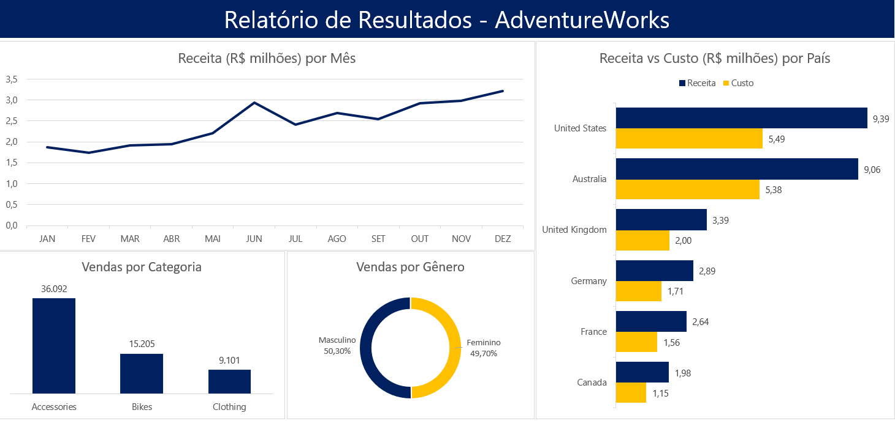
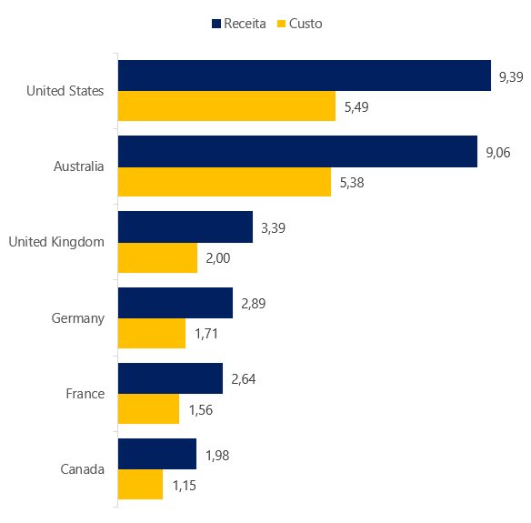
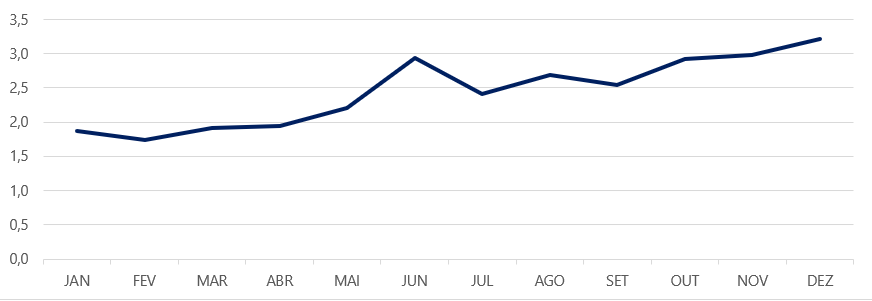
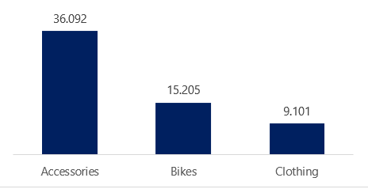
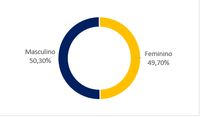

# Projeto de Integração SQL Server e Excel: Análise de Vendas da AdventureWorks Cycles

## Apresentação

Este projeto tem como objetivo integrar o banco de dados AdventureWorks do SQL Server com o Excel para analisar as vendas online da empresa fictícia AdventureWorks Cycles. O foco principal é extrair informações pertinentes sobre as vendas realizadas em 2013 e apresentá-las de maneira clara e organizada no Excel.

## Indicadores do Projeto

***Os indicadores analisados neste projeto são:***
* Total de vendas online por categoria de produto
* Receita total online por mês do pedido
* Receita e custo total online por país
* Total de vendas online por sexo do cliente

## Tabelas Analisadas

***As tabelas do banco de dados AdventureWorks utilizadas neste projeto são:***
* **FactInternetSales**: Contém informações sobre as vendas online, como número do pedido, data, quantidade vendida, custo e receita.
* **DimCustomer**: Contém informações sobre os clientes, como nome, sobrenome e sexo.
* **DimSalesTerritory**: Contém informações sobre os territórios de vendas, como país.
* **DimProductCategory**: Contém informações sobre as categorias de produtos, como nome.
* **DimProductSubcategory**: Contém informações sobre as subcategorias de produtos.
* **DimProduct**: Contém informações sobre os produtos.

## Colunas da View VENDAS

Para facilitar a análise dos dados, foi criada a view VENDAS com as seguintes colunas:
```
CREATE OR ALTER VIEW VENDAS AS
SELECT
    f.SalesOrderNumber AS 'Numero do Pedido',
    f.OrderDate AS 'Data do Pedido',
    pc.EnglishProductCategoryName AS 'Categoria ',
    c.FirstName + ' ' + c.LastName AS 'Nome do Cliente',
    c.Gender AS 'Sexo',
    st.SalesTerritoryCountry 'País',
    f.OrderQuantity 'Quantidade Vendida',
    f.TotalProductCost AS 'Custo Total do Produto',
    f.SalesAmount AS 'Receita da Venda'
FROM
    FactInternetSales AS f
JOIN
    DimCustomer AS c ON f.CustomerKey = c.CustomerKey
JOIN
    DimSalesTerritory AS st ON f.SalesTerritoryKey = st.SalesTerritoryKey
JOIN
    DimProduct AS p ON f.ProductKey = p.ProductKey
JOIN
    DimProductSubcategory AS ps ON p.ProductSubcategoryKey = ps.ProductSubcategoryKey
JOIN
    DimProductCategory AS pc ON ps.ProductCategoryKey = pc.ProductCategoryKey;
```


## Integração com o Excel

Após a criação da view VENDAS, os dados foram importados para o Excel utilizando ferramentas como Microsoft Query ou Power Query. No Excel, foram criadas tabelas dinâmicas, gráficos e outros recursos para analisar os indicadores de vendas definidos no projeto.

### Dashboard Resultante



## Screenshots e Exemplos

**Abaixo estão algumas imagens do dashboard gerado:**

### Receita Total versus Custo Total por País



### Receita por Mês



### Vendas por Categoria



### Vendas por Gênero



## Conclusão

Este trabalho demonstra como integrar dados do SQL Server com o Excel para a análise eficaz das vendas, proporcionando insights valiosos para a tomada de decisões. O uso da view **VENDAS** simplificou o processo de extração de dados e permitiu uma análise mais ágil e visual no Excel.
Através da análise de vendas da AdventureWorks Cycles, podemos extrair alguns insights importantes:

**Desempenho de vendas por categoria de produto**: A categoria Accessories, com pouco mais de 36 mil vendas, é responsável por mais da metade do total, enquanto Bikes e Clothing juntas representam cerca de 24 mil vendas.

**Tendências de vendas ao longo do tempo**: Ao analisar a receita total ao longo do ano, podemos identificar uma grande tendência de aumento a partir de setembro, que se estende até dezembro, seguida de uma queda considerável em janeiro. De fevereiro a julho, há uma evolução gradual nos ganhos da empresa.

**Análise de vendas por país**: Ao analisar a receita e o custo total online por país, podemos identificar quais países têm o maior volume de vendas e onde os recursos estão sendo investidos proporcionalmente. Nesse contexto, é notável que Estados Unidos e Austrália assumem o protagonismo dos ganhos e investimentos da empresa.

**Segmentação do mercado por sexo do cliente**: Os dados indicam que a AdventureWorks têm relevância entre ambos os gêneros. Essa informação é especialmente relevante no contexto de segmentação de clientes, haja visto que, nesse caso, o gênero parece não influenciar significativamente as preferencias dos clientes.

Esses são apenas alguns exemplos dos dados relevantes que podem ser extraídos da análise de vendas da AdventureWorks Cycles. Com base nesses insights, é possível tomar decisões informadas para impulsionar o crescimento e o sucesso do negócio.

## Como visualizar o código
Clone o repositório:
git clone https://github.com/seu_usuario/nome_do_repositorio.git

Abra o projeto no seu editor de preferência.

Siga as instruções no arquivo README para configurar o ambiente e executar as queries.
